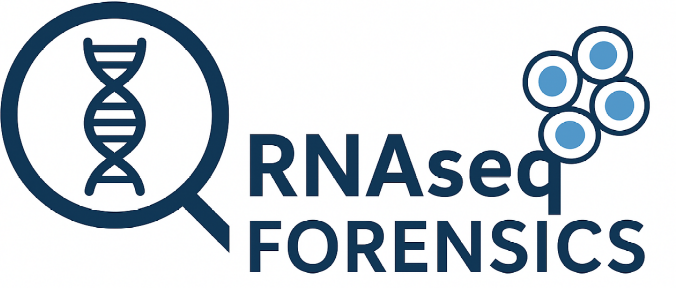
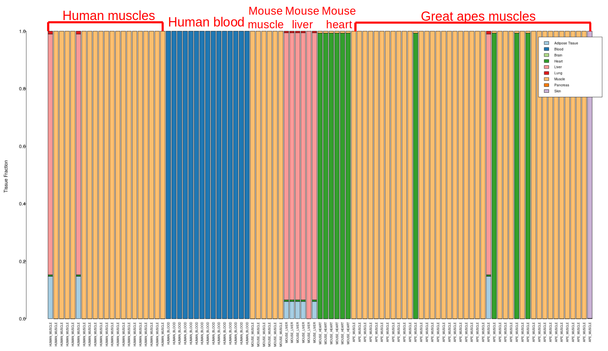
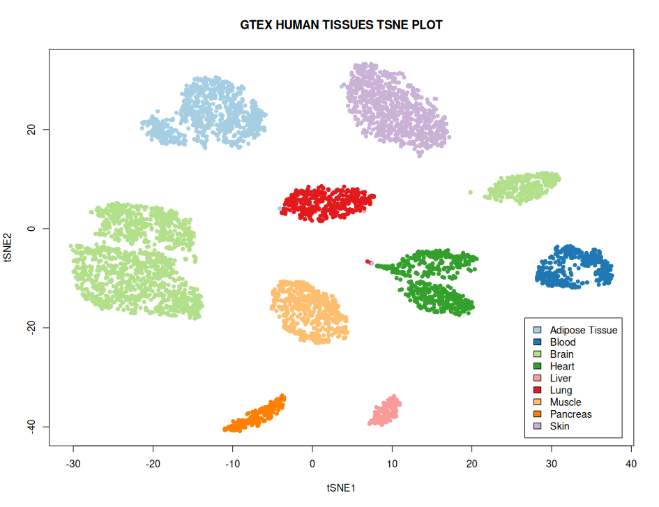
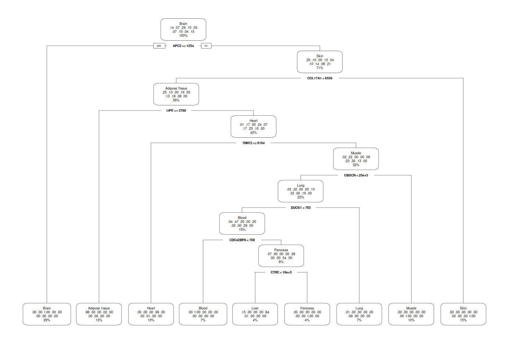
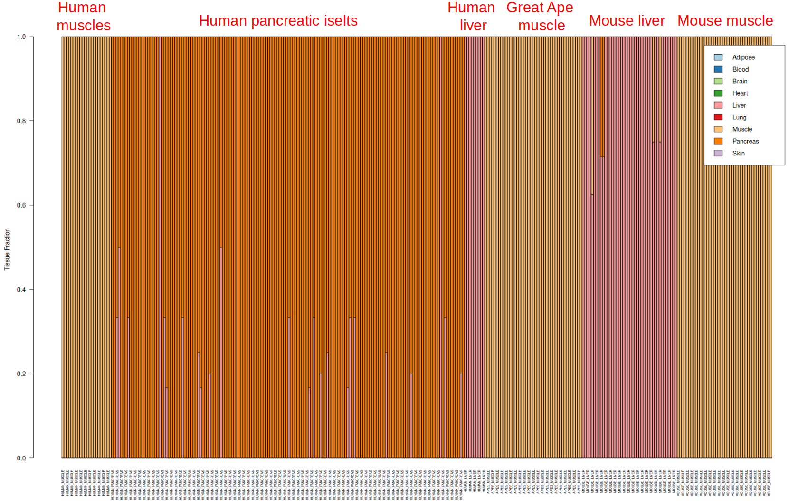

  

# RNAseq Forensics
This is a computational machine learning method for detecting unwanted tissue signals in RNAseq samples.

## Quick start
To predict contamination, you need to provide a gene expression matrix `merged_tissues_organisms.txt` and run the following command line:

    Rscript RNAseq_Tissue_Predictor.R merged_tissues_organisms.txt

The output of the tool is the quantification of transcriptomic contribution from different tissues to each RNAseq sample:

  

The tool was validated on five independent RNAseq gene expression datasets originating from muscle, liver, heart and blood tissues from human, mouse and apes. RNAseq Forensics achieved the average 92% of accuracy on the validation datasets.

## Training RNAseq Forensics
The tools was trained with decision tree on the GTEX https://gtexportal.org gene expresion data from several human tissues. The GTEX v.7 gene expression matrix and sample annotation can be downloaded from: https://drive.google.com/drive/folders/1AuHLbv_VqVgLmz9GptN80adjjbUaNj4I?usp=drive_link. Exploratory analysis with tSNE revealed very distinct clustering of the samples from different tissues in terms of gene expression, which implies that a machine learning model should be straightforward to train for cross-tissue contamination assessment.

  

The decision tree learns key genes separating the GTEX samples from different tissues in the form of the following hierarchical organization:

  

## Training a baseline model
RNAseq Forensics can be trained simply by memorizing tissues-specific genes. The procedure of extracting tissue-specific genes using GTEX data is explained in the `tissue_specific_genes/OrthologsFunction.Rmd` notebook. To predict contamination with the baseline model, you need to provide a gene expression matrix `merged_tissues_organisms_baseline.txt` and run the following command line:

    Rscript RNAseq_Forensics.R merged_tissues_organisms_baseline.txt

The output of the tool is the quantification of transcriptomic contribution from different tissues to each RNAseq sample:

  

The validation accuracy of this baseline model is also very high. A proper banchmarking of those two models on a number of RNAseq gene expression datasets across tissues and mammalian organisms is to be done.
